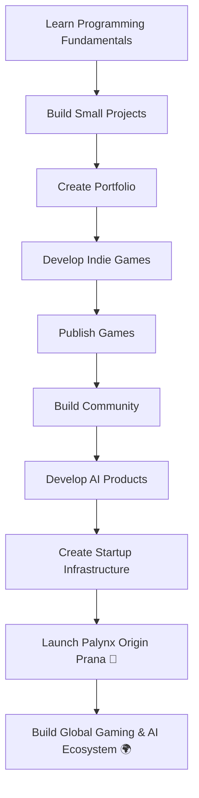

# 

<div align="center">


</div>

---

# 🎮 Welcome to My Digital Universe


## 👩‍💻 About Me

Hello! I'm **Palak Dhanotiya**, a passionate **BTech Computer Science Engineering Student** from **India 🇮🇳**.

I'm on a mission to transform ideas into reality through:

🎮 Game Development
🤖 Artificial Intelligence
💻 Software Development
🚀 Technology Entrepreneurship

My long-term vision is to build:

# 🌌 Palynx Origin Prana

A futuristic gaming and AI-powered technology company focused on creating innovative digital experiences, intelligent systems, and next-generation products.

---

## 🌱 Current Learning Journey

```text
📚 Learning Progress

Python              ███████░░░
Java                ██████░░░░
HTML                ████████░░
CSS                 ███████░░░
JavaScript          █████░░░░░
Git & GitHub        ███████░░░
Game Development    ████░░░░░░

Mission:
Build → Learn → Launch → Scale
```

---

# ⚡ Tech Stack

### 💻 Languages

<p align="left">

</p>

### 🛠 Development Tools

<p align="left">

</p>

### 🚀 Future Technologies

<p align="left">

</p>

### 🎮 Game Development Path

```text
Game Design
Game Mechanics
Unity
Unreal Engine
AI in Games
Procedural Systems
Indie Game Publishing
```

---

# 🚀 Projects & Goals

### Current Focus

* 🔹 Building strong programming foundations
* 🔹 Creating GitHub projects consistently
* 🔹 Learning software development workflows
* 🔹 Understanding AI fundamentals
* 🔹 Exploring game development concepts

### Upcoming Goals

* 🎮 Publish my first indie game
* 🤖 Build AI-powered applications
* 🌐 Create a professional portfolio
* 📱 Launch useful software products
* 🚀 Start building the foundation of Palynx Origin Prana

---

# 🛣️ Roadmap to Build Palynx Origin Prana



---

# 🌐 Connect With Me

<p align="left">

<a href="www.linkedin.com/in/palak-dhanotiya">

</a>

<a href="github.com/palakdhanotiya">

</a>

</p>

> Replace the placeholder links with your actual social profiles.

---

# 📊 GitHub Analytics

<div align="center">


</div>

---

# 🔥 GitHub Streak

<div align="center">


</div>

---

# 📈 Contribution Activity

<div align="center">


</div>

---

# 🏆 Achievement Mindset

```text
Every great company started as an idea.
Every successful founder started as a beginner.

Today I learn.
Tomorrow I build.
One day I lead.
```

---

# 💡 Vision Statement

> "I don't just want to build software.
> I want to create worlds, experiences, and technologies that inspire people."

### Future Vision

🎮 Games that people remember

🤖 AI that solves real problems

🚀 Technology that creates impact

🌌 A company that pushes innovation forward

---

<div align="center">

### ⭐ Building the Future, One Project at a Time ⭐

**Palak Dhanotiya**
Future Founder • Developer • Creator • Innovator

🚀 Palynx Origin Prana — From Dream to Reality

</div>
