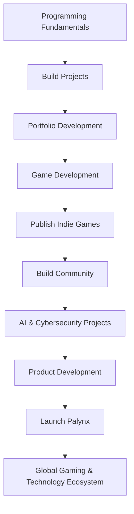

# 

<div align="center">


</div>

---

# 🎮 Welcome to My Digital Universe


## 👩‍💻 About Me

Hi, I'm **Palak Dhanotiya**, a BTech Computer Science Engineering student from India 🇮🇳.

I enjoy building projects that combine technology, creativity, and problem-solving. My interests span game development, artificial intelligence, cybersecurity, software engineering, and entrepreneurship.

Currently, I'm focused on strengthening my technical foundations while building projects, conducting research, and working toward my long-term vision.

---

## 🌌 Building Palynx

**Palynx** is my long-term vision for creating innovative games, intelligent products, and impactful technology solutions.

```text
Learn → Build → Launch → Scale
```

---

## 🎯 Current Focus

🎮 Building a Unity-based Indie Game

🔐 Researching Cybersecurity Risks of AI-Generated Code

🌐 Learning Backend Development with Flask & Django

🤖 Exploring Artificial Intelligence Fundamentals

🚀 Building the foundation of Palynx

📂 Expanding my GitHub portfolio through consistent projects

---

# 📚 Skills & Learning Journey

## ✅ Completed Foundations

```text
Python
Java
C
C++
HTML
CSS
Git & GitHub
Unity Basics
Blender Basics
Research Writing
```

## 🌱 Currently Learning

```text
Flask
Django
JavaScript
Artificial Intelligence Fundamentals
Cybersecurity Fundamentals
Database Management Systems
Software Engineering
Advanced Unity Development
Game Systems Design
```

---

# ⚡ Tech Stack

### 💻 Languages

<p align="left">

</p>

### 🌐 Web Development

<p align="left">

</p>

### 🛠 Tools & Technologies

<p align="left">

</p>

### 🎮 Game Development

<p align="left">

</p>

### 🚀 Exploring

<p align="left">

</p>

---

# 💼 Experience

### Python Development Intern

**Sysslan (Remote Internship)**

* Completed Python development tasks and assignments
* Worked with GitHub for version control and project management
* Strengthened programming and problem-solving skills
* Gained practical software development experience

---

# 🚀 Featured Projects

### 🎮 Cozy Village Adventure Game

A low-poly Unity game featuring exploration, collectibles, environmental storytelling, and village restoration mechanics using custom Blender-created assets.

### 🔐 AI Code Security Research

**Research Topic: Cybersecurity Risks of AI-Generated Code**

Studying security vulnerabilities, risks, and secure coding practices associated with AI-assisted software development.

### 🌐 Web Development Journey

Building backend applications using Flask and Django while learning software architecture and deployment workflows.

### 📂 GitHub Portfolio

Maintaining multiple repositories covering Python development, programming fundamentals, research work, web technologies, and game development.

---

# 🛣️ Roadmap


```mermaid
graph TD

A[Programming Fundamentals] --> B[Build Projects]

B --> C[Portfolio Development]

C --> D[Game Development]

D --> E[Publish Indie Games]

E --> F[Build Community]

F --> G[AI & Cybersecurity Projects]

G --> H[Product Development]

H --> I[Launch Palynx]

I --> J[Global Gaming & Technology Ecosystem]
```

---

# 📊 GitHub Analytics

<div align="center">


</div>

---

# 🔥 GitHub Streak

<div align="center">


</div>

---

# 📈 Contribution Activity

<div align="center">


</div>

---

# 🌐 Connect With Me

<p align="left">

<a href="https://www.linkedin.com/in/palak-dhanotiya">

</a>

<a href="https://github.com/palakdhanotiya">

</a>

</p>

---

# 🏆 Mindset

```text
Every expert was once a beginner.
Every project starts with an idea.
Every company starts with a vision.

Today I learn.
Tomorrow I build.
One day I lead.
```

---

# 💡 Vision

> I want to build games, products, and technologies that create meaningful experiences and solve real-world problems.

### Long-Term Goals

🎮 Build memorable games

🤖 Create intelligent products

🔐 Develop secure technology

🚀 Launch innovative ventures

🌍 Contribute to the future of technology

---

<div align="center">

## ⭐ Building the Future, One Project at a Time ⭐

### Palak Dhanotiya

**Developer • Game Creator • Researcher • Builder**

🌌 Building Palynx

</div>
